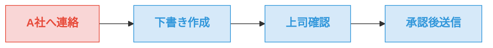
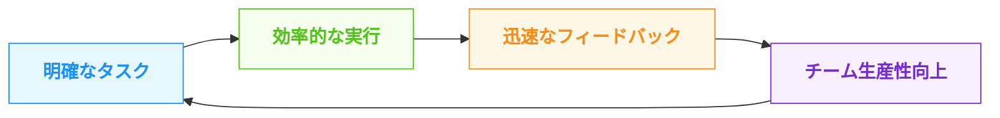

<!-- 全体スタイル -->

## タスクをアクション動詞で書くメリット

  

    

    

      

        

          
タスクを制する者が

          
仕事を制する

        

      

    

  

---
layout: two-cols
---

# 主張：アクション動詞で書く

  

    単なる書き方ではなく<b>思考法</b>
  

  

    抽象的な名詞より<b>具体的な動詞</b>で
  

  

    「脳内ツッコミ」で具体化すれば生産性が高まる
  

::right::

  

    

    

    

      
会議の準備

      

        → 資料を3ページ作成し 
        → 参加者に事前送付し 
        → 会議室を予約する
      

    

  

---
layout: image-right
image: https://source.unsplash.com/collection/94734566/1920x1080
---

# 1. アクション動詞の力

  

    

      検討する
    

    
→

    

      3案を比較し選択する
    

  

  

    

      確認する
    

    
→

    

      テストして結果を記録する
    

  

  

    

      Led
    

    
→

    

      Orchestrated / Redesigned
    

  

---
layout: center
class: text-center
---

# 2. 脳内ツッコミのプロセス

  

    
A社へ連絡

    
抽象的・曖昧

  

  
→

  

    

      
脳内ツッコミ

      
"具体的には何をするの？"

    

  

  
→

  

    
具体的なステップ

    
明確なアクション

  

  

    
1. 下書き作成

    
A社X様向けに提案内容を整理

  

  

    
2. 上司確認

    
内容と表現の適切さを確認

  

  

    
3. 承認後送信

    
修正を反映させ期限内に送信

  

---
layout: center
---

# 3. 生産性向上の3つの理由

  

    

      
💪

    

    
意志力の節約

    

      

        

        判断に悩む時間を削減
      

      

        

        実行のハードルが下がる
      

    

  

  
  

    

      
⏱️

    

    
正確な見積り

    

      

        

        隠れた工数が明確化
      

      

        

        待ち時間の把握が容易
      

    

  

  
  

    

      
🔄

    

    
明確な共有

    

      

        

        役割の明確化
      

      

        

        関係者の準備が容易に
      

    

  

---
layout: image-right
image: https://source.unsplash.com/xkArbdUcUeE/1920x1080
---

# 4. チームでの効果

  

    

      
🔄

    

    

      
スムーズな調整

      
依頼の意図と行動が明確化

    

  

  
  

    

      
💡

    

    

      
効果的なフィードバック

      
具体的タスクへの適切な助言

    

  

  
  

    

      
📈

    

    

      
生産性の向上

      
チーム全体のスループット改善

    

  

---
layout: center
---

# 5. 幅広い応用範囲

  

    

      

        
アクション 動詞

      

      

        
個人のタスク管理

      

      

        
チームへの依頼

      

      

        
企画書・提案書

      

      

        
議事録・報告書

      

      

        
プロジェクト計画

      

      

        
業務マニュアル

      

    

  

---
layout: two-cols
---

# Before / After

  

    
Before（曖昧）

    

      
〇〇について検討

      
A社へ連絡

      
資料作成

      
会議の準備

    

    

      ⚠️ 抽象的で実行が難しい 
      ⚠️ 工数見積もりが困難 
      ⚠️ 何をしたか不明確
    

  

::right::

  

    
After（具体的）

    

      
〇〇を整理し<b class="text-green-700">スライド1枚にまとめる</b>

      
A社X様へメールを<b class="text-green-700">下書き→上司確認→送信</b>

      
データを<b class="text-green-700">グラフ化し5ページの報告書を作成</b>

      
資料を準備し<b class="text-green-700">参加者に事前共有</b>→会議室を予約

    

    

      ✅ すぐに実行できる 
      ✅ 正確な見積もりが可能 
      ✅ 目に見える成果が明確
    

  

---
layout: center
class: text-center
---

<h1 class="bg-white bg-opacity-80 px-6 py-3 rounded-lg shadow-md inline-block text-blue-800 border-b-4 border-blue-500 mb-6">まとめ</h1>

  

    

    

      

        
✍️

      

      
タスクの書き方の改善

      

        アクション動詞で具体的に書き 
        「脳内ツッコミ」で細分化する
      

    

  

  
  

    

    

      

        
🚀

      

      
得られる効果

      

        意志力の節約 
        時間見積りの精度向上 
        チームコミュニケーション円滑化
      

    

  

  「タスクを制する者が仕事を制する」

